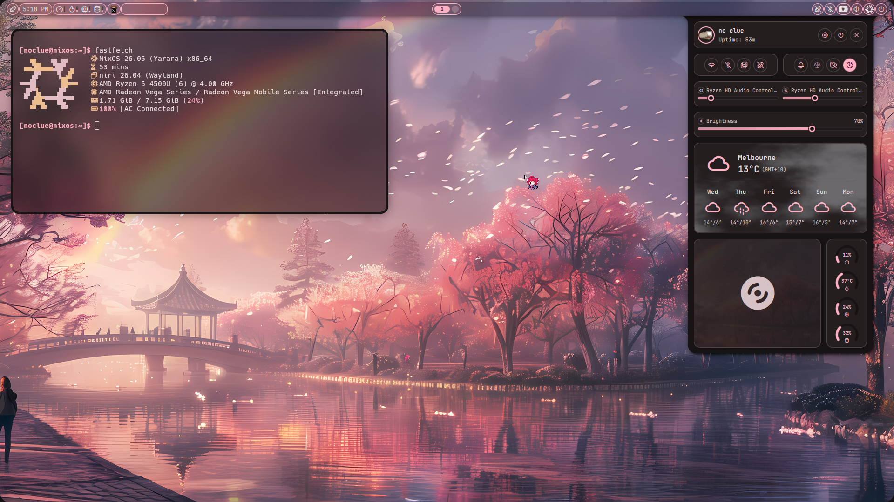
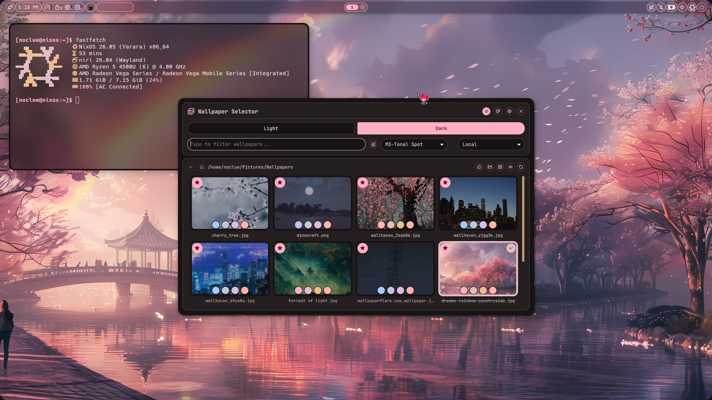
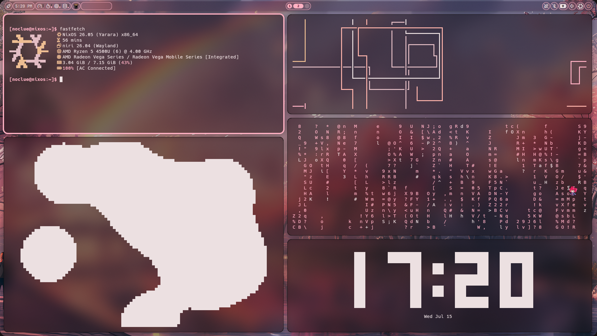
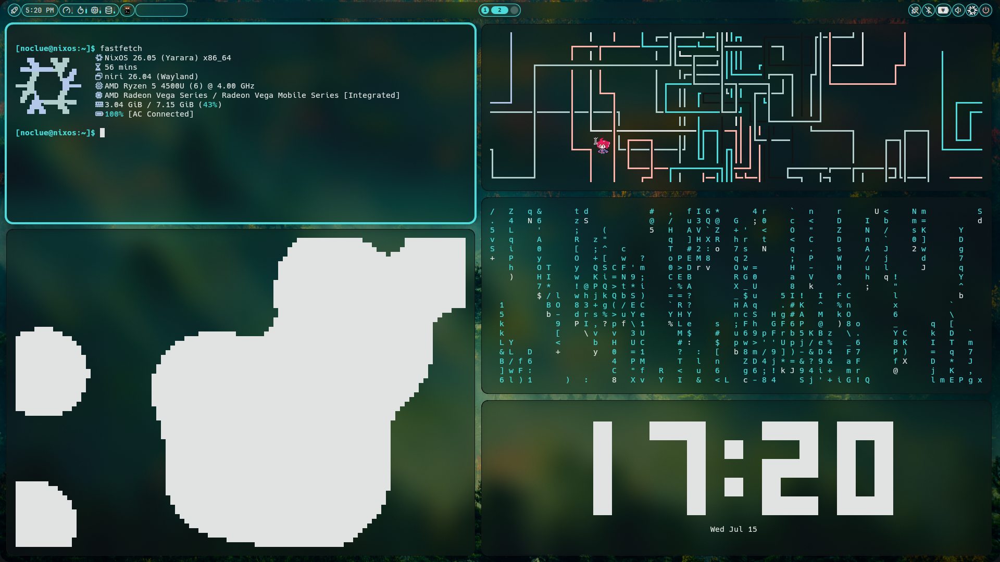
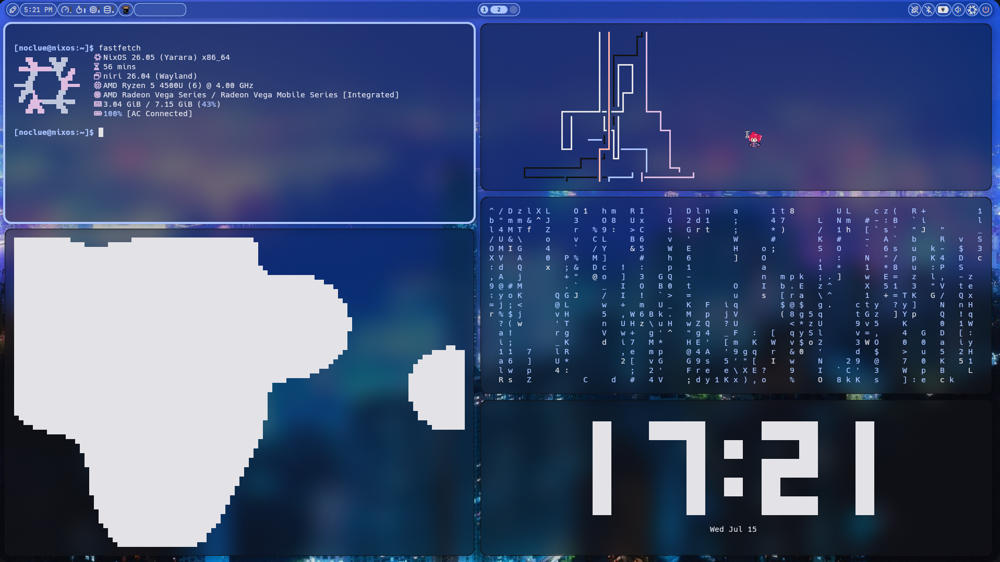

# SCROLL DOWN FOR README ⬇️⬇️









# Niri and Noctalia
This setup features a dynamic, scrolling-window workspace using  the Niri compositor and styled with the Noctalia shell bar.

## System Components
* **Compositor:** [Niri](https://github.com) (Scroll-based Wayland window manager)
* **Status Bar & Shell:** Noctalia v4 (Dynamic Material You theme engine)
* **Terminal Emulator:** Kitty
* **System Fetch:** Fastfetch

## 📦 Dependencies
Ensure you have these tools installed before applying the dotfiles:
* `pwvucontrol` or `pavucontrol` (for the audio volume widget)
* `cliphist` and `wl-clipboard` (for app launcher clipboard history)
* `JetBrains Mono` (font used in the noctalia)
* `Niri` (Main compositor)
* `Noctalia` (Main shell)
* `Kitty` (Terminal)
* `Fastfetch` (System info)
  
## Installation

1. **Clone this repository:**
   ```bash
   git clone https://github.com/noclueatthis/niri-noctalia-dotfiles && cd niri-noctalia-dotfiles
   ```

2. **Backup your current configurations:**
   ```bash
   mkdir -p ~/.config/backup
   cp -r ~/.config/{niri,noctalia,kitty,fastfetch} ~/.config/backup/
   ```

3. **Copy the dotfiles to your system:**
   ```bash
   cp -r niri/ noctalia/ kitty/ fastfetch/ ~/.config/
   ```

##  Highlights
* **Dynamic Aesthetics:** Noctalia automatically generates `noctalia.kdl` inside the Niri directory to dynamically sync active window border colors with your system palette.
* **Unified Theme:** Kitty configurations are explicitly linked via `current-theme.conf` to maintain color harmony across terminal interfaces.


## Supported Distributions
These configurations are completely **distribution-agnostic** and work on any Linux OS running a modern Wayland environment. They have been verified or are fully supported on:
* **Arch based distros** (Highly recommended, packages available in AUR)
* **Fedora / Bazzite** (Fully supported)
* **Void Linux** (Natively supported via official repositories)
* **NixOS** (What I personally use)
